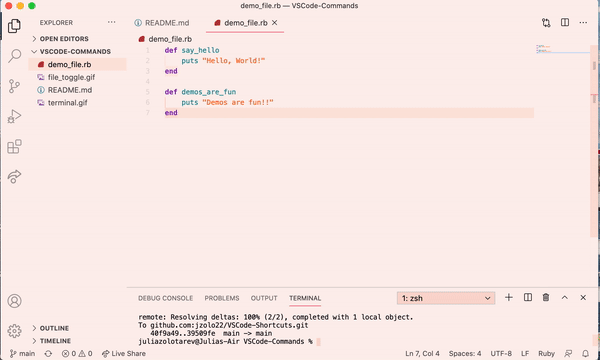
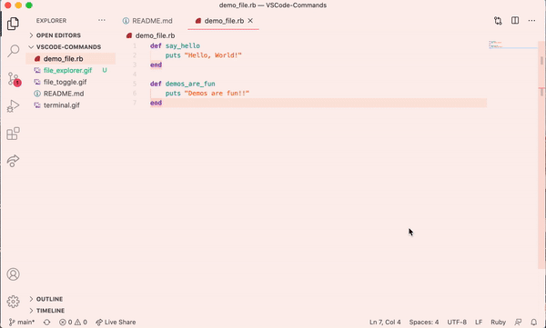
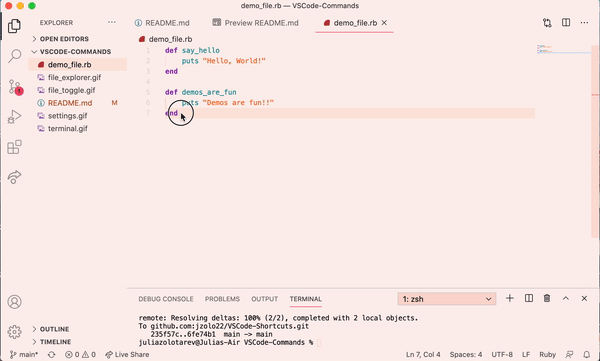
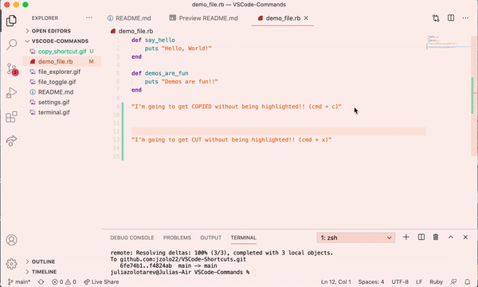

# VSCode Shortcuts (on a Mac)

## ```ctrl + ` ``` --> toggle the built-in terminal on and off
  


## ```ctrl + tab ``` --> toggle between the last two files you were working on


## ```cmd + b``` --> toggle the folder view on and off



## ```cmd + shift + p ``` --> open settings search



## ```option + shift + up OR down arrow ``` --> copy everything on that line OR everything that's highlighted onto the line above or the line below



## ```ctrl + c```, ```ctrl + x``` --> copy, cut (in that order) BUT you don't have to highlight text. It will copy or cut the whole line your cursor is currently on. (Great for deleting extra lines)




> Feel free to open a pull request and add ones you use frequently!